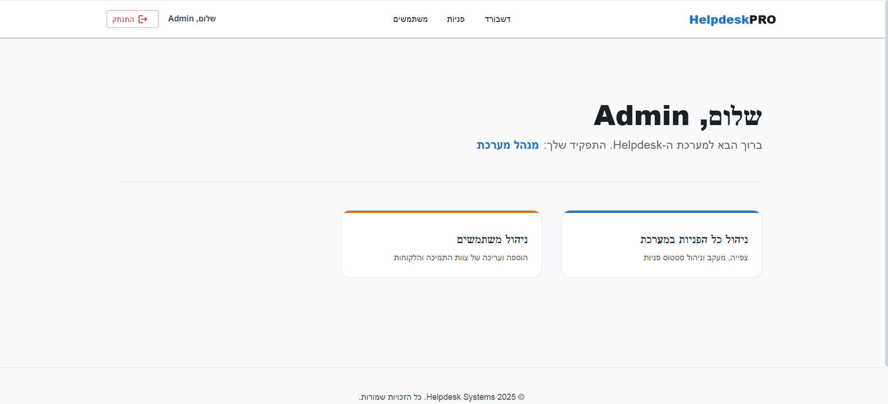

# 🖥️ Helpdesk Client (React + TypeScript)

The frontend layer of the Helpdesk system, designed for high performance and intuitive user interaction.

## 🛠️ Tech Stack
* **Framework:** React 18 (Vite)
* **Language:** TypeScript (Strict Typing)
* **UI Library:** Material UI (MUI)
* **State Management:** Context API & useReducer
* **Networking:** Axios with custom Interceptors

## 🔑 Frontend Features
* **Dynamic Routing:** Protected routes that redirect based on JWT authentication status.
* **Role-Tailored UI:** Components render conditionally based on user permissions (RBAC).
* **Real-time Feedback:** Integrated SweetAlert2 and MUI Snackbar for user notifications.

## 📂 Structure
* `src/context`: Global Auth and Ticket states.
* `src/services`: Centralized API wrapper handling Bearer tokens.
* `src/pages`: Responsive views for Dashboard, Login, and Ticket Creation.